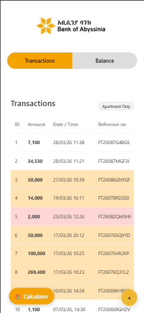
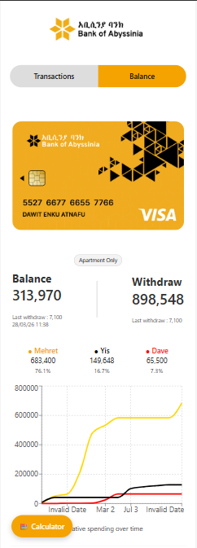

# 💳 Bank Tracker (Receipt-Based Expense Tracker)

A custom-built web application designed to track and organize bank transactions based on receipt data.

This project was developed as a **requested solution** for managing construction expenses within a shared family bank account.

---

## 📸 Screenshots

---

## 🚀 Overview

This system allows users to:

- Track all transactions from a single bank account
- Separate spending by different individuals
- Monitor total withdrawals and remaining balance
- View receipt details directly from links
- Analyze spending patterns visually

---

## ⚙️ How It Works

1. The system starts with a **base balance**
2. Each transaction is added via a **receipt link**
3. The backend **extracts transaction data** from the receipt
4. Data is stored and displayed in a structured table
5. The system automatically:
   - Calculates total withdrawals
   - Updates current balance
   - Categorizes transactions by user

---

## 🎯 Key Features

### 🧾 Transaction Tracking
- Displays all transactions in a table format
- Includes:
  - Amount
  - Date
  - Reference number
  - Narrative
- Direct link to view original receipt

---

### 🎨 Smart Categorization
Transactions are visually categorized:
- 🟡 Yellow
- 🔴 Red 
- ⚪ White/Default

---

### 💰 Balance System
- Shows:
  - Current balance
  - Total withdrawn amount
  - Last transaction details

---

### 📊 Spending Analytics
- Side-by-side comparison of spending
- Percentage contribution per person
- Cumulative spending graph over time

---

### 🔍 Receipt Scraping (Advanced)
The system automatically extracts transaction data using:

- 🔗 Receipt links
- 📷 Image-based receipt uploads
- 🔳 QR code scanning

This allows flexible and fast data entry without manual input.

---

### 🧮 Built-in Calculator
- Quick calculations inside the app
- Toggle visibility anytime

---

### 🔐 Simple Authentication
- Password-protected access
- Device-based authentication (no repeated login on same device)

---

## 🛠️ Tech Stack

### Frontend
- React.js
- CSS (custom styling, mobile-first design)

### Backend
- Node.js (Express)
- Puppeteer (for web scraping)

### Database
- Supabase

### Deployment
- Vercel (Frontend)
- Render (Backend)

---

## 📱 Design Approach

- Mobile-first UI
- Responsive layout (mobile + desktop support)
- Clean and minimal interface
- Fast and lightweight

---

## 📌 Project Context

This project was built as a **custom client request** to solve a real-world problem:

Managing construction expenses from a shared bank account used by multiple individuals.

The goal was to create a system that is:
- Simple to use
- Visually clear
- Accurate in tracking
- Minimal manual work

---

## 🔮 Future Improvements

- Export data (CSV / Excel)
- Advanced filtering
- Monthly analytics
- Improved AI-based receipt parsing
- Multi-user authentication system

---

## ⚠️ Notes

- Data accuracy depends on receipt format consistency
- Scraping may require updates if bank layouts change

---

## 👨‍💻 Author

Developed as a custom project with assistance from abyssinia bank (ALL DATA IN THE GITHUB REPO USED ARE SAMPLE).

---
