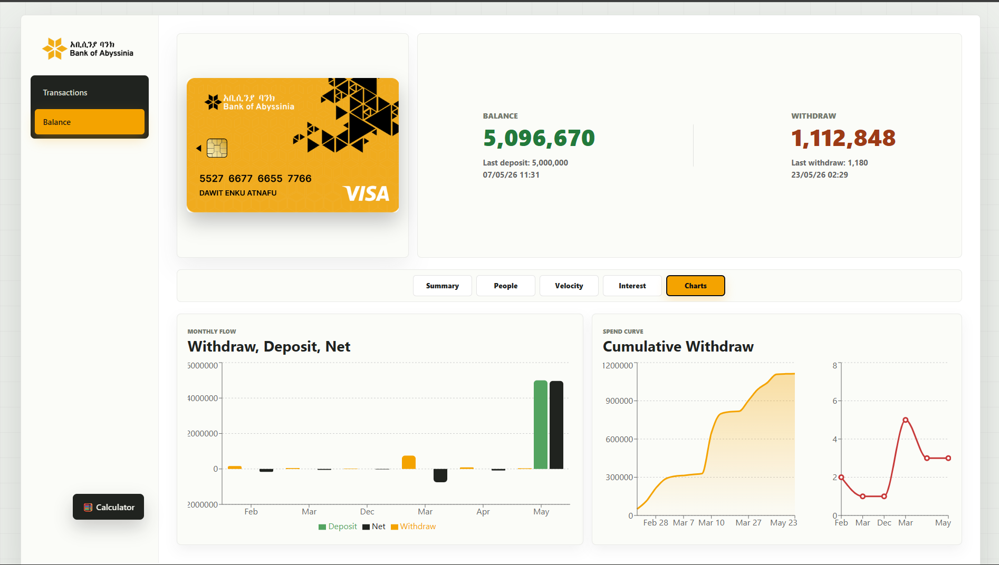

# 💳 Bank Tracker (Receipt-Based Expense Tracker)

A custom-built web application designed to track and organize bank transactions based on receipt data.

This project was developed as a **requested solution** for managing construction expenses within a shared family bank account.

---

## 📸 Screenshots

---

## 🚀 Overview

This system allows users to:

* Track all transactions from a single bank account
* Separate spending by different individuals
* Monitor total withdrawals and remaining balance
* View receipt details directly from links, QR codes, or images
* Analyze spending patterns visually with interactive analytics

---

## ⚙️ How It Works

1. The system starts with a **base balance**
2. Each transaction is added using one of the following methods:

   * Receipt link
   * QR code scan
   * Image (OCR-based extraction)
3. The backend extracts transaction data from receipts
4. Data is stored in a structured database (Supabase)
5. The system automatically:

   * Calculates total withdrawals and deposits
   * Updates current balance
   * Categorizes transactions by user

---

## 🎯 Key Features

### 🧾 Transaction Tracking

* Displays all transactions in a structured table
* Includes:

  * Amount
  * Date
  * Reference number
  * Narrative
* Direct link to original receipt (Bank of Abyssinia slip system)

---

### 🎨 Smart Categorization

Transactions are automatically grouped by person:

* 🟡 Construction group (Name1, Name2, ...null)
* 🔴 Groups
* ⚫ Members
* ⚪ Other

Each group has its own analytics breakdown and spending share visualization.

---

### 💰 Balance System

* Shows:

  * Current balance (base balance - total withdrawals)
  * Total withdrawals and deposits
  * Last transaction details
* Toggle visibility for sensitive values

---

### 📊 Advanced Analytics Dashboard

Includes multi-panel insights:

* Monthly income vs spending trends
* Spending velocity (7-day rolling window)
* Cumulative spend curve
* People contribution breakdown
* Interest estimation based on daily rate

---

### 🔍 Receipt Intake System (Advanced)

The system supports multiple receipt ingestion methods:

#### 🔗 Link-based scraping

* Fetches receipt data from bank URLs
* Backend scraping via Node.js (Puppeteer-based service)

#### 📷 Image OCR scanning

* Uses **Tesseract.js** to extract text from screenshots
* Parses amount, date, reference, and narrative

#### 📷 QR Code scanning

* Uses browser **BarcodeDetector API**
* Supports live camera scanning
* Auto-detects receipt links or transaction references
* Smart camera selection (rear camera preferred)
* Optional zoom control for clarity

---

### 🧮 Built-in Calculator

* Quick calculator tool inside the app
* Toggle visibility anytime

---

### 🔐 Authentication System

* Simple password-based login 
* Session persistence via localStorage
* No repeated login on same device

---

### 🔐 Interest Lock Feature

* Sensitive interest calculations are hidden by default
* Unlock using an **encoded password** (not stored in plain text)
* Session-based unlock (stored in sessionStorage)
* Toggle visibility without re-entering password during session

---

## 🛠️ Tech Stack

### Frontend

* React.js (Hooks-based architecture)
* Recharts (analytics & visualization)
* CSS (custom responsive design, both phone and desktop vsn)
* Tesseract.js (OCR engine)
* BarcodeDetector API (QR scanning)

### Backend

* Node.js (Express)
* Puppeteer (receipt scraping)
* REST API layer for transaction handling

### Database

* Supabase (PostgreSQL + REST API)
* Direct REST fallback for update/delete operations when API fails

### Deployment

* Vercel (Frontend)
* Render (Backend)

---

## 📱 Design Approach

* Mobile-first UI design
* Fully responsive (mobile + desktop)
* Minimal and fast interface
* Optimized for real-world daily usage

---

## 📌 Project Context

This project was built as a **custom client request** to solve a real-world problem:

Managing construction expenses from a shared bank account used by multiple individuals.

The goal was to create a system that is:

* Simple to use
* Visually clear
* Accurate in tracking
* Minimal manual work

---

## 🔮 Future Improvements

* CSV / Excel export system
* AI-based receipt parsing improvements
* Multi-user role-based authentication

---

## ⚠️ Notes

* Data accuracy depends on receipt format consistency
* Bank layout changes may require scraping updates
* Camera and OCR accuracy depends on device quality

---

## 👨‍💻 Author

Developed as a custom project with assistance from abyssinia bank (ALL DATA IN THE GITHUB REPO USED ARE SAMPLE).
